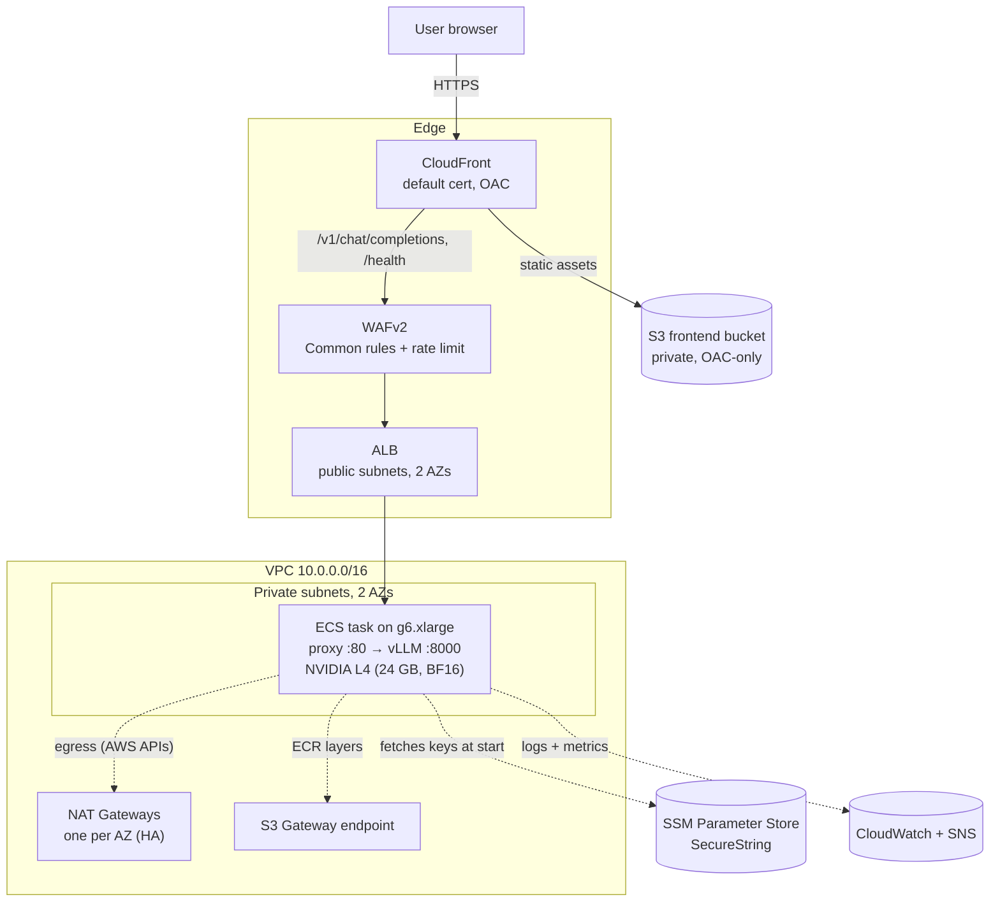

# Scalable LLM Inference Service on AWS

Google Gemma 4 E2B IT served via vLLM on ECS-on-EC2, with scale-to-zero, SSE token streaming, and a vanilla HTML/JS chat UI delivered through CloudFront.

## What this is

A personal project exploring end-to-end LLM deployment on AWS: a real GPU-backed instruction-tuned LLM behind a public-facing chat interface, with the entire stack defined in Terraform.

The system idles at zero EC2 instances when nobody is using it, wakes up automatically on the first request, streams tokens to the browser as they're generated, and falls back to zero after 15 minutes of silence. Cost-aware by design — idle baseline is mostly the NAT Gateways and ALB; the expensive GPU only runs while there's actual chat traffic.

## Architecture



**Request flow (chat message).** The browser loads `index.html`, `style.css`, and `app.js` from CloudFront's S3 origin. On user input, `app.js` issues `POST /v1/chat/completions` as a *same-origin* relative path; CloudFront's `/v1/*` and `/health` cache behaviors route those to the ALB origin. The ALB forwards to the ECS task on container port 80 (IP-mode targets, `awsvpc` networking). The **proxy** container — a small FastAPI service — validates the `x-api-key` header, then proxies to `127.0.0.1:8000/v1/chat/completions` with `Authorization: Bearer <internal_api_key>` injected. **vLLM** streams the OpenAI Chat Completions SSE format back; the proxy streams each raw chunk straight through (`httpx` stream + `StreamingResponse`, no buffering or caching), and ALB and CloudFront pass them on unbuffered. The browser parses `choices[0].delta.content` and appends tokens to the assistant bubble in real time.

## Stack

| Layer | Component |
|---|---|
| IaC | Terraform ≥ 1.10, AWS provider `~> 6.45` (resolves to 6.45.x) |
| State | S3 backend with native conditional-write locking (`use_lockfile = true`) |
| Compute | ECS-on-EC2, `g6.xlarge`, 1× NVIDIA L4 (24 GB, Ada `sm_89`, native BF16) |
| Model serving | vLLM v0.20.2, OpenAI-compatible HTTP API on port 8000 |
| Model | `google/gemma-4-E2B-it` (instruction-tuned, ungated, Apache 2.0), BF16 |
| Sidecar | FastAPI proxy (`python:3.14-slim`) — `x-api-key` validation + SSE-friendly reverse proxy |
| Networking | VPC, 2 AZs, one NAT Gateway per AZ (HA), S3 Gateway endpoint |
| Edge | CloudFront (default cert, Origin Access Control), WAFv2 (AWS Managed Common Rule Set + 1000 req/IP/5 min rate limit) |
| Secrets | Two SSM `SecureString` parameters; ECS execution role decrypts at task launch |
| Observability | CloudWatch dashboard (6 widgets), 3 SNS-subscribed alarms, 2 silent autoscaling-trigger alarms |
| Autoscaling | Three cooperating policies covering 0→1, 1→N, and N→0 |

## First-time setup

The Terraform state bucket is **external infrastructure** — Terraform writes its state to it on the first apply but cannot create it as part of its own deploy. Bootstrap manually, once per AWS account:

```bash
aws s3api create-bucket \
  --bucket gemma-inference-tfstate-ds \
  --region eu-central-1 \
  --create-bucket-configuration LocationConstraint=eu-central-1

aws s3api put-bucket-versioning \
  --bucket gemma-inference-tfstate-ds \
  --versioning-configuration Status=Enabled
```

SSE-S3 encryption is automatic on new buckets (no separate step). Versioning is enabled because state-corruption recoverability is worth more than the trivial extra storage cost.

You also need:

- AWS CLI configured (`aws configure`) with credentials for an account that has GPU quota — specifically the **Running On-Demand G and VT instances** vCPU limit must be ≥ 4 in your target region.
- Docker (for building the vLLM and proxy images locally before pushing to ECR).
- Terraform ≥ 1.10.

## Configuration

```bash
cp terraform/terraform.tfvars.example terraform/terraform.tfvars
```

Then edit `terraform.tfvars` and fill in the three required values (`public_api_key`, `internal_api_key`, `alert_email`):

| Variable | Required | Default | Description |
|---|---|---|---|
| `aws_region` | no | `eu-central-1` | Target AWS region |
| `project_name` | no | `gemma-inference` | Naming prefix for every resource |
| `vpc_cidr` | no | `10.0.0.0/16` | VPC CIDR (subnets carved as `/24`s under this) |
| `instance_type` | no | `g6.xlarge` | EC2 GPU instance type — Gemma 4 requires L4-class, not T4 |
| `min_capacity` | no | `0` | Minimum ECS service tasks (0 enables scale-to-zero) |
| `max_capacity` | no | `3` | Maximum ECS service tasks (ceiling for load-based scale-out) |
| `public_api_key` | **yes** | — | User-facing token; clients send it in the `x-api-key` header |
| `internal_api_key` | **yes** | — | Token shared between the proxy and vLLM; the proxy injects it as `Authorization: Bearer` |
| `system_prompt` | no | (sensible chatbot-persona string) | Prepended as the first message in every conversation |
| `alert_email` | **yes** | — | Email subscribed to the SNS alerts topic |

Both API keys are stored as `SecureString` parameters in SSM, not as plaintext env vars in the task definition. They must differ from each other for the dual-key defense-in-depth model to mean anything.

## Deploy

```bash
git clone https://github.com/dinosmuc/llm-cloud-deployment.git
cd llm-cloud-deployment
```

**One-command deploy.** `scripts/deploy.sh` runs the three ordered steps below for you, with a confirmation prompt at each:

```bash
./scripts/deploy.sh                       # init → ECR → build/push → full apply → output
```

The ordering is not optional: the ECR repository must exist before images can be pushed, and the images must be in ECR before the rest of the stack scales a task up — otherwise the first request fails with an image-pull error. The script encodes that order. To run it by hand instead (e.g. to understand each step):

```bash
cd terraform
terraform init                          # connects to the state bucket
terraform apply -target=module.ecr      # ECR repo must exist before images can push

cd ..
./scripts/build_and_push.sh             # build + push the vllm and proxy images

cd terraform
terraform apply                          # everything else
terraform output                         # frontend_url, api_url, public_api_key
```

After the first `terraform apply`, AWS will send a confirmation email to the address in `alert_email`. **Click the confirmation link** — until you do, the SNS subscription remains pending and no alarm notifications will flow. After roughly 3 days of pending status, AWS auto-deletes the subscription and you have to re-run `terraform apply` to recreate it.

The build script honors `AWS_REGION` and `ECR_REPO_NAME` env-var overrides for one-off non-default targets:

```bash
AWS_REGION=us-east-1 ECR_REPO_NAME=gemma-staging ./scripts/build_and_push.sh
```

Defaults match the Terraform variable defaults.

## First use

Open the `frontend_url` from `terraform output`. Paste the `public_api_key` value at the top of the page and click Connect. Type a message and hit Enter.

**First request after deploy: expect 5–8 minutes of "Warming up…"** before any tokens appear. This is the cold-start chain:

1. ALB has no healthy targets → returns HTTP 503.
2. `wake_on_503` CloudWatch alarm fires (1 minute).
3. `scale_out_wake` policy sets ECS service desired count from 0 to 1.
4. ECS asks the capacity provider for capacity → ASG launches a `g6.xlarge` instance (~90 s).
5. EC2 boots, ECS agent registers (~30 s).
6. ECS pulls the ~18 GB vLLM image. The bulk model-weight layer goes over the **S3 Gateway endpoint** (free); the smaller vLLM runtime layers go over the task's same-AZ NAT Gateway.
7. vLLM starts, loads the Gemma 4 weights into the L4's VRAM, opens port 8000.
8. The proxy (which waited on vLLM's `HEALTHY` status via `dependsOn`) starts.
9. ALB target group reports healthy.
10. The frontend's `retryUntilReady` polls `/health` every 15 s; on the first OK it automatically re-sends the original message.

The status pill shows `Warming up… (attempt N/40, ~X min elapsed)` throughout, so the user can gauge progress.

After the cold start, subsequent messages stream sub-second to first token, around 30–80 tokens/sec depending on prompt length. After 15 minutes of zero ALB traffic, `scale_in_idle` returns the service to 0 and the next request restarts the cycle.

## Autoscaling design

Three cooperating policies, each handling a distinct regime so they never conflict:

| Policy | Type | Trigger | Effect |
|---|---|---|---|
| `scale_out_wake` | Step (ExactCapacity = 1) | `wake_on_503` alarm: ≥ 1 ALB-level 503 in 1 min | 0 → 1 |
| `scale_out_load` | Target tracking | `ALBRequestCountPerTarget` > 600 req/target/min | 1 → up to `max_capacity` |
| `scale_in_idle` | Step (ExactCapacity = 0) | 15 consecutive minutes of zero ALB requests | N → 0 |

The wake policy uses `HTTPCode_ELB_503_Count` rather than target-group metrics, because per-target metrics aren't published when no targets exist — the ALB's own 503 counter is the only signal available at `desired_count = 0`. The load policy sets `disable_scale_in = true` so it never fights the idle policy; all scale-in is delegated to `scale_in_idle`. For typical single-user usage the system spends almost all of its time at 0 or 1; `max_capacity = 3` is architectural headroom that only comes into play under genuine concurrent load.

## Cost

Rough monthly figures for `eu-central-1`. "Idle" is what you pay when the service is at `desired_count = 0`.

| Item | Idle | Active (per hour of GPU runtime) |
|---|---|---|
| NAT Gateways (2 × one per AZ, HA) | ~$76 | + ~$0.05/GB processed |
| ALB | ~$16 | + LCU charges |
| WAFv2 (Web ACL + managed rule set + rule) | ~$6 | + $0.60 per million requests |
| CloudWatch (logs, dashboard, alarms) | ~$2 | + log ingestion |
| ECR (image storage, ~18 GB) | ~$1.80 | — |
| `g6.xlarge` (NVIDIA L4 on-demand) | — | ~$0.95 / hour |
| SSM Standard, S3 Gateway endpoint, SNS standard | $0 | — |
| **Estimated total** | **~$102 / month** | **+ GPU runtime** |

The two NAT Gateways dominate the idle bill. This is the *if-left-running* figure; in practice the stack is torn down between sessions, so the idle baseline only accrues while deployed — at ~$0.10/hour for both NATs combined, the HA second NAT adds only ~5 cents per hour of testing. Over ~20 hours of cumulative active GPU time (tearing down between sessions), expect roughly **€30–60 total**.

## Trade-offs and known limitations

Listed plainly so the design choices are visible:

- **NAT Gateway cost (HA).** The deployment runs one NAT Gateway per AZ so an AZ failure can't sever the other AZ's egress and cross-AZ data-transfer charges are avoided — the production-correct pattern. The trade-off is ~$76/month idle for the two NATs vs ~$38 for a single shared one; acceptable here because the stack is destroyed between sessions, so NAT cost only accrues while actually deployed.
- **Cold-start latency of 5–8 minutes** on the first request after idle. Inherent to GPU scale-to-zero: ASG launch + 18 GB image pull + model load. The frontend handles it gracefully (10-minute retry window, clear progress messaging), but a real user would notice.
- **State bucket name `gemma-inference-tfstate-ds` is hardcoded** in the backend block. Terraform backends cannot reference variables, so reusing this codebase for a different AWS account or environment requires either editing the backend `bucket` value directly or supplying `-backend-config` overrides at `terraform init` time.
- **`scale_out_load` target of 600 req/target/min is an educated estimate**, not a benchmark. L4-on-Gemma-4-E2B-BF16 real throughput should be measured under realistic prompt-length distributions and the value tuned. The current setting was chosen to roughly correspond to ~10 concurrent conversations per task.
- **HTTPS terminates at CloudFront only.** The CloudFront → ALB hop is plain HTTP, and the certificate is the default `*.cloudfront.net`. A production deployment would add an ACM certificate in `us-east-1` (CloudFront's required region) plus another in the ALB's region, set up Route 53, and switch the CloudFront origin protocol policy to `https-only`.
- **Effective single-task ceiling in practice.** `max_capacity = 3` is configured but a single-user demo never hits the conditions that would trigger load-based scale-out. The architecture supports it; the demo just doesn't exercise it.

## Teardown

```bash
./scripts/destroy.sh        # or: cd terraform && terraform destroy
```

`destroy.sh` is a thin convenience wrapper (it `cd`s into `terraform/` and confirms before running `terraform destroy`); plain `terraform destroy` is equivalent.

**If the destroy times out** waiting on the ECS service to reach `INACTIVE` (it can sit in `DRAINING` past the 20-minute wait when a capacity provider with managed termination protection is in play), **just re-run it** — by the second run the task has finished draining and the destroy completes, including terminating the GPU instance via the ASG.

Two things `terraform destroy` does *not* remove — both are external infrastructure:

- The S3 state bucket (`gemma-inference-tfstate-ds`).
- If you ran an earlier iteration of this project: any leftover state bucket or `terraform-locks` DynamoDB table from before the switch to S3 native locking.

Delete those manually via the AWS Console or CLI after the destroy completes. The state bucket has versioning enabled, so `aws s3api delete-objects` with explicit version IDs is needed before the bucket itself can be removed (or use the Console's "Empty bucket" flow, which handles versions for you).

## References

- vLLM documentation: https://docs.vllm.ai/
- Gemma 4 E2B IT model card: https://huggingface.co/google/gemma-4-E2B-it
- Amazon ECS on EC2: https://docs.aws.amazon.com/AmazonECS/latest/developerguide/
- Terraform AWS provider: https://registry.terraform.io/providers/hashicorp/aws/latest/docs
- CloudFront Origin Access Control: https://docs.aws.amazon.com/AmazonCloudFront/latest/DeveloperGuide/private-content-restricting-access-to-s3.html
- SSM Parameter Store (SecureString): https://docs.aws.amazon.com/systems-manager/latest/userguide/sysman-paramstore-securestring.html

## License

MIT
