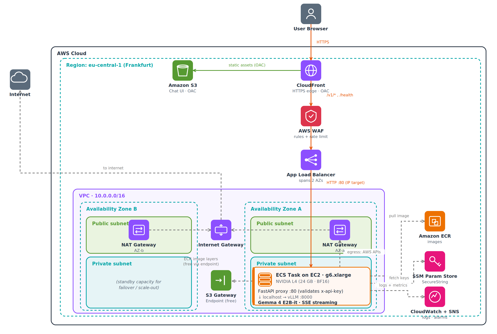

# Scalable LLM Inference Service on AWS

Self-hosted **Google Gemma 4 (E2B-it)** served with **vLLM** on ECS-on-EC2, behind a CloudFront + ALB edge, with **scale-to-zero** GPU and real-time token streaming to a vanilla HTML/JS chat UI. The whole stack is defined in **Terraform**.

A personal project exploring end-to-end LLM deployment on AWS — the model runs on my own GPU, not a third-party API.

## Architecture



**Request flow:** browser → CloudFront (static UI from a private S3 bucket via OAC; `/v1/*` → ALB) → WAF → ALB → ECS task. A small **FastAPI proxy** validates the `x-api-key`, then forwards to **vLLM** on localhost with an internal Bearer token; vLLM streams tokens back as Server-Sent Events.

## Highlights

- **High availability** — VPC across 2 AZs; one NAT Gateway per AZ; ALB and Auto Scaling Group span both.
- **Cost-efficient** — scale-to-zero: 0 GPU when idle, wakes on the first request, returns to 0 after 15 min.
- **Secure** — private subnets (no public IP on the GPU), WAF + rate limit, dual-key auth, secrets in SSM SecureString (KMS), private S3 served only via CloudFront OAC.
- **Reproducible** — 100% Terraform, 6 modules, one-command deploy.

## Stack

| Layer | Choice |
|---|---|
| IaC | Terraform ≥ 1.10, AWS provider `~> 6.45` (S3 backend, native locking) |
| Compute | ECS-on-EC2 · `g6.xlarge` (NVIDIA L4, BF16) |
| Serving | vLLM v0.20.2 (OpenAI-compatible API) · Gemma 4 E2B-it |
| Proxy | FastAPI sidecar — `x-api-key` auth + SSE pass-through |
| Edge | CloudFront (OAC) + WAFv2 · ALB across 2 AZs |
| Secrets | SSM Parameter Store (SecureString, KMS) |
| Observability | CloudWatch dashboard + alarms · SNS email |

## Prerequisites

- AWS account + CLI configured. GPU quota: **Running On-Demand G and VT instances ≥ 4 vCPU**.
- Docker and Terraform ≥ 1.10.
- A one-time S3 state bucket (Terraform cannot create its own backend):

  ```bash
  aws s3api create-bucket --bucket gemma-inference-tfstate-ds --region eu-central-1 \
    --create-bucket-configuration LocationConstraint=eu-central-1
  aws s3api put-bucket-versioning --bucket gemma-inference-tfstate-ds \
    --versioning-configuration Status=Enabled
  ```

## Configure

```bash
cp terraform/terraform.tfvars.example terraform/terraform.tfvars
```

Set `public_api_key`, `internal_api_key` (must differ), and `alert_email`.

## Deploy

```bash
./scripts/deploy.sh
```

This runs the required order: **create ECR → build & push images → apply the rest**. The order matters — the images must exist before any task scales up. (`terraform output` then prints `frontend_url` and `public_api_key`.)

## Use

Open `frontend_url`, paste the `public_api_key`, and chat.

The **first request after idle** triggers a cold start (~5 min when warm, up to ~15 min on a brand-new deploy) while the GPU launches and vLLM loads the model — the UI shows progress and resends automatically. After that, responses stream sub-second to first token.

## Teardown

```bash
./scripts/destroy.sh        # or: cd terraform && terraform destroy
```

If `destroy` times out while the ECS service drains, just run it again. The S3 state bucket is external infrastructure — delete it manually if you no longer need it.

## Cost

Idle baseline (2 NAT Gateways + ALB + WAF + CloudWatch) ≈ **$0.10/hour**, continuous. The GPU (~$0.98/hour) runs only while serving. Tear down between sessions to avoid the idle baseline.

## Notes

- HTTPS terminates at CloudFront (edge); full end-to-end TLS (ACM + Route 53 custom domain) is future work.
- Cold-start latency is inherent to GPU scale-to-zero.
- A vCPU quota of 4 limits the demo to one `g6.xlarge` at a time.

## License

MIT
