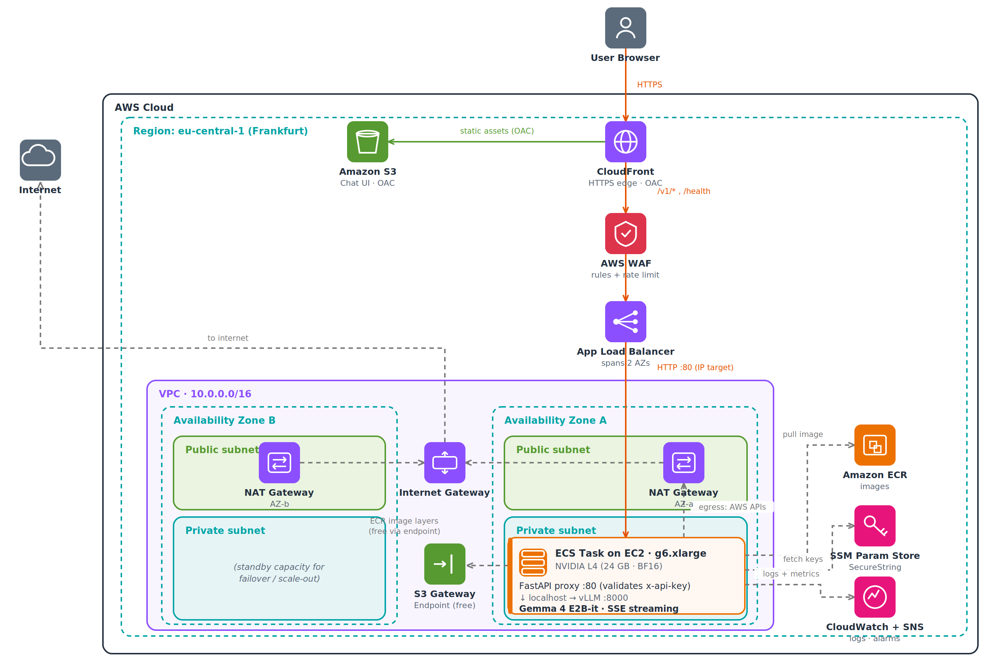

# Scalable LLM Inference Service on AWS

Self-hosted **Google Gemma 4 (E2B-it)** served with **vLLM** on ECS-on-EC2, behind a CloudFront + ALB edge, with **scale-to-zero** GPU and token streaming to a vanilla HTML/JS chat UI. Defined entirely in **Terraform**.

A personal project exploring end-to-end LLM deployment on AWS — the model runs on my own GPU, not a third-party API.

## Architecture



**Request flow:** browser → CloudFront (static UI from a private S3 bucket via OAC; `/v1/*` → ALB) → WAF → ALB → ECS task. A **FastAPI proxy** validates the `x-api-key`, then forwards to **vLLM** on localhost with an internal Bearer token; vLLM streams tokens back as Server-Sent Events.

| Layer | Choice |
|---|---|
| IaC | Terraform ≥ 1.10, AWS provider `~> 6.45` (S3 backend, native locking) |
| Compute | ECS-on-EC2 · `g6.xlarge` (NVIDIA L4, BF16) |
| Serving | vLLM v0.20.2 (OpenAI-compatible API) · Gemma 4 E2B-it |
| Proxy | FastAPI sidecar — `x-api-key` auth + SSE pass-through |
| Edge | CloudFront (OAC) + WAFv2 · ALB across 2 AZs |
| Secrets | SSM Parameter Store (SecureString, KMS) |
| Observability | CloudWatch dashboard + alarms · SNS email |
| CI | GitHub Actions — format, validate, unit tests (no AWS access) |

**Multi-AZ** VPC, NAT per AZ, ALB and ASG across both — see [Limitations](#limitations) for the availability caveat. **Scale-to-zero**: no GPU when idle, wakes on the first request, back to zero after 15 idle minutes. **Secure**: private subnets, WAF rate limiting, dual-key auth, SSM SecureString, Hugging Face token via BuildKit secret, S3 reachable only through CloudFront OAC.

## Prerequisites

The automation is four Bash scripts. It runs natively on **Linux** and **macOS** — no GNU-only flags or Bash 4 syntax, so macOS's stock `/bin/bash` is fine, and your interactive shell can be zsh. On **Windows** it needs **WSL2**; run everything inside the Linux filesystem.

| Tool | Tested | Minimum | Needed for |
|---|---|---|---|
| Terraform | 1.15.6 | 1.10.0 | everything (`use_lockfile` needs ≥ 1.10) |
| AWS CLI | 2.34.0 | 2.x | deploy, state bucket, cache invalidation |
| Docker | 29.5.3 | 23.0 | image build (needs BuildKit/Buildx) |
| Python | 3.14 (image) / 3.11 (tests) | 3.11 | proxy + tests |
| Node.js | 24 | 22 | frontend tests only |
| OpenSSL | 3.x | any | generating API keys on first deploy |

**AWS** — credentials with permission to create VPC, ECS, EC2, ALB, CloudFront, S3, ECR, IAM, SSM, WAF and CloudWatch resources. GPU quota **Running On-Demand G and VT instances ≥ 4 vCPU** is not granted by default; request it in Service Quotas first, approval can take a day.

**Hugging Face** — accept Google's licence on the `google/gemma-4-E2B-it` model page, then create a read token.

## Deploy

```bash
git clone https://github.com/dinosmuc/llm-cloud-deployment.git
cd llm-cloud-deployment

export HF_TOKEN=hf_...
./scripts/deploy.sh
```

No configuration step. `deploy.sh` generates `terraform/terraform.tfvars` on the first run — two API keys from `openssl rand -base64 24`, defaults for the rest, mode `600`. It writes the file **only when absent**, because the keys live in SSM and rewriting them would redeploy the service for nothing. Deleting it makes the next deploy generate fresh keys.

To pin values yourself, `cp terraform/terraform.tfvars.example terraform/terraform.tfvars` and edit it before deploying. Or override these while generating:

| Variable | Default | |
|---|---|---|
| `ALERT_EMAIL` | *(empty)* | CloudWatch alarm emails. Empty creates no subscription; alarms and the SNS topic exist either way. |
| `AWS_REGION` | `eu-central-1` | Region to deploy into. |
| `PROJECT_NAME` | `gemma-inference` | Prefix for every resource name and the state bucket. |
| `INSTANCE_TYPE` | `g6.xlarge` | GPU instance type. Gemma 4 attention needs L4-class, not T4. |

The script prompts twice; `AUTO_APPROVE=1` answers both (same for `destroy.sh`). What it does:

1. **Preflight** — tools, credentials, Docker daemon, `buildx`, `HF_TOKEN`; generates `terraform.tfvars`; warns if the GPU vCPU quota is below 4.
2. **State backend** — creates `<project_name>-tfstate-<account-id>` (versioned, encrypted, private), writes `backend.hcl`, runs `terraform init`. The account ID keeps the name collision-free, which is why nothing is hardcoded. Re-runs reuse it.
3. **ECR first** — applied alone with `-target=module.ecr`, so images have somewhere to go.
4. **Build and push** — repository URL read back from Terraform, so the build cannot target the wrong repo. The image bakes in the weights: **~20 min** in the measured run.
5. **Apply the rest** — plan, confirm, apply.

To run Terraform by hand afterwards: `terraform init -backend-config=backend.hcl`.

## Use

```bash
cd terraform
terraform output frontend_url
terraform output -raw public_api_key    # -raw required; value is sensitive
```

Open the URL, paste the key, chat.

The first request after idle triggers a cold start — **16 min 41 s** on a brand-new deploy in the measured run, of which 13 min 24 s was pulling the 18 GB image; ~5 min when warm. The UI shows progress and resends automatically. After that, sub-second to first token.

## Checks

```bash
python3 -m venv .venv && source .venv/bin/activate
pip install -r tests/requirements.txt
./scripts/check.sh
```

`python3 -m venv` is silent for up to half a minute while installing pip — let it finish. The virtualenv is not optional on Debian, Ubuntu 23.04+, Fedora and Amazon Linux, whose system Python refuses a bare `pip install`.

No AWS credentials, deployment or Docker needed (a fresh `terraform init` does fetch providers). 28 tests:

- `terraform fmt -check`, `terraform validate` (`-backend=false`), shell and Python syntax
- **proxy** — missing, wrong or unconfigured `x-api-key` rejected with 401; a valid one swapped for the internal Bearer token; streamed response passes through byte-for-byte
- **frontend** — an SSE event split across network chunks is reassembled, checked at every possible split point
- **config contracts** — what a clean clone depends on: the example tfvars declares every variable without a default and its placeholders are the ones validation refuses; `app.js` and the module rendering it agree on template variables and pass them through `jsonencode`; `deploy.sh`'s tfvars parser reads the example; both scripts support `AUTO_APPROVE`. The generation branch is then run for real and its output checked — mode `600`, valid `fmt`-clean HCL, two distinct accepted keys, the four overrides, and that a second run leaves an existing file untouched.

GitHub Actions runs the same script on every push and pull request, with no AWS access and no secrets.

## Teardown

```bash
./scripts/destroy.sh                    # AUTO_APPROVE=1 to skip the prompt
PURGE_STATE=1 ./scripts/destroy.sh      # also delete the state bucket
```

Works from a fresh clone — it rebuilds `backend.hcl` if missing — but it still needs `terraform/terraform.tfvars`, since Terraform wants values for variables without defaults even to plan a destroy.

**Destroy, retried once.** If `terraform destroy` times out — typically while the ECS service drains — it waits 60 seconds and tries exactly once more. Not hypothetical: in the measured teardown the service sat in `DRAINING` for ~26 min with every task already stopped, past Terraform's 20-minute delete timeout, and the retry finished it. The service now declares a 40-minute timeout, so the first pass should succeed. A second failure exits non-zero and leaves the state bucket alone.

**Leftover check.** Queries the Resource Groups Tagging API for anything tagged `Name=<project_name>-*` in the region. A smoke test, not a guarantee: untagged resources are invisible to it, global ones like CloudFront may not appear, and ECS task definition revisions are counted separately because ECS only ever marks them `INACTIVE`. Without `tag:GetResources` the result is reported as unknown.

**State bucket.** Kept by default; `deploy.sh` creates it outside the stack, so `terraform destroy` never sees it. `PURGE_STATE=1` deletes every object version first (the bucket is versioned, so `aws s3 rb --force` alone fails), then the bucket. Re-running after a purge is fine — it skips the destroy and still runs the leftover check.

## Cost

Idle baseline ≈ **$0.16/hour** (~$118/month), whether or not anyone uses it:

| Component | Approx. hourly |
|---|---|
| 2 × NAT Gateway | $0.104 |
| ALB | $0.027 |
| Public IPv4 (2 × ALB, 2 × NAT EIP) | $0.020 |
| WAF (web ACL + 2 rules) | $0.010 |

Plus ~$1.80/month for ECR storage of the 18 GB image. The GPU (~$0.98/hour) runs only while serving. Tearing the stack down between sessions is the single biggest saving.

## Troubleshooting

| Symptom | Cause and fix |
|---|---|
| `VcpuLimitExceeded` / instance never launches | GPU quota not granted. Request **Running On-Demand G and VT instances** ≥ 4 vCPU. |
| Image build fails downloading the model | `HF_TOKEN` not exported, or Google's licence not accepted. |
| `denied: authorization token has expired` | ECR login lasts 12 h. Re-run `./scripts/deploy.sh`. |
| No alarm emails | `alert_email` empty, or the SNS subscription not confirmed. Alarms still fire — check CloudWatch. |
| UI stuck on "Still warming up" | Normal during a cold start; it retries ~22 min. Beyond that check ECS service events and `/ecs/<project>/vllm`. |
| `terraform init` asks for a bucket | Run it with `-backend-config=backend.hcl`, or just use `./scripts/deploy.sh`. |

## Limitations

- **Availability is partial.** Infrastructure spans two AZs; inference does not. One GPU task, scaled to zero, so the service is unavailable during a cold start. Continuous availability means `min_capacity = 1` and an always-on GPU.
- **TLS terminates at the edge.** CloudFront → ALB is plain HTTP. End-to-end TLS needs a custom domain and ACM certificate.
- **The ALB is publicly reachable**, so the API can be called directly, bypassing CloudFront. A direct request carries no `X-Forwarded-For`, and WAF skips a forwarded-IP rule when the header is absent, so it is not rate-limited either. An answer still needs a valid key, but a direct 503 can trigger an unauthenticated scale-up. Closing this needs origin verification.
- **Rate limiting is best-effort.** WAF aggregates on the first `X-Forwarded-For` address, which a caller can influence.
- **Scale-out is effectively inert.** The target-tracking policy aims at 600 requests per target per minute — ~300× the peak observed in testing. Streaming inference saturates far below that, and the latency alarm is no backstop: `TargetResponseTime` measures only time to the first response header (87 ms for replies taking many seconds). A useful signal would be in-flight concurrency or vLLM queue depth. An honest threshold needs load testing this project has not done.
- **Waking from zero launches two instances.** ECS managed scaling always scales out to two initially when no container instances are running. Only one receives the task; the spare is drained about 15 minutes later.
- **Scale-in is all-or-nothing** — capacity returns only to zero, after 15 consecutive minutes without ALB requests. No graduated 3 → 2 → 1.
- **Cold start** is inherent to GPU scale-to-zero, the trade for not paying ~$0.98/hour to idle.
- **Single-turn chat.** The UI sends the system prompt plus the current message; no history.
- **Five WAF body rules are counted, not blocked.** The Core Rule Set rejects ordinary chat prose — a pasted article over 8 KB, `<script>`, `../`, an IPv4 host. Overridden to `Count`, so they still report. Every other rule and the rate limit still block.
- **AZs are chosen by index.** The subnets take the first two AZs the region reports, without checking `g6` is offered there. If not, `terraform apply` succeeds and the task stays pending.

## License

MIT — see [LICENSE](LICENSE).
